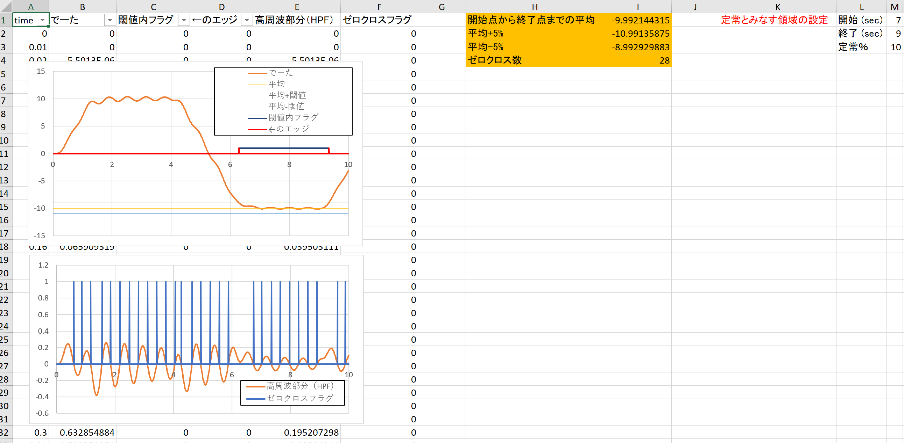
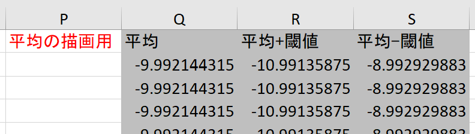
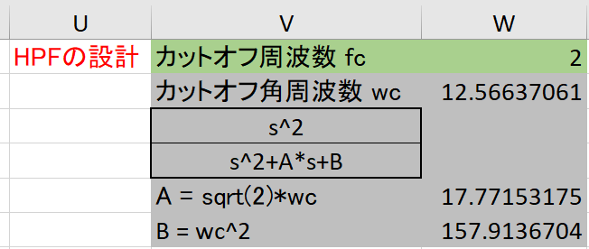
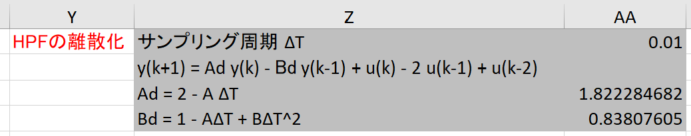
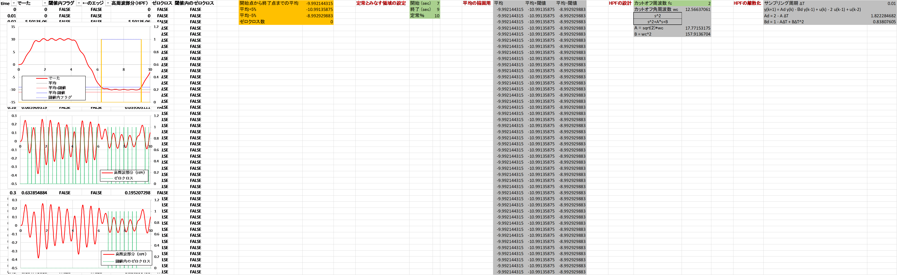
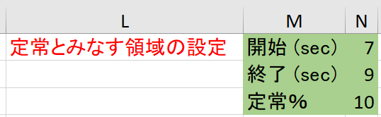

# README











↓自分で設定する値  



## C列：閾値内フラグ  

C2

```
=IF(OR(AND(B2<$J$2,B2>$J$3),AND(B2>$J$2,B2<$J$3)),TRUE,FALSE)
```

## D列：C列のエッジ  

D2

```
=FALSE
```

D3

```
=IF(C2<>C3,TRUE,FALSE)
```

## E列：高周波部分（HPF）  

E2 ~ E3

```
=$AA$3*E3-$AA$4*E2+B4-2*B3+B2
```

## F列：ゼロクロス  

F2

```
=FALSE
```

F3

```
=IF(E3*E2<0,TRUE,FALSE)
```

## G列：閾値内のゼロクロス  

G2

```
=AND(C2,F2)
```

開始点から終了点までの平均

```
=AVERAGEIFS($B$2:$B$1002,$A$2:$A$1002,">"&$N$1開始(sec),$A$2:$A$1002,"<"&$N$2終了(sec))
```

平均±5%

```
=$J$1平均*(1±$N$3定常%/100)
```

ゼロクロス数

```
=COUNT(F2:F1002)
```

カットオフ角周波数 wc

```
=$W$1*2*PI()
```

A = sqrt(2)*wc

```
=SQRT(2)*$W$2
```

B = wc^2

```
=$W$2^2
```
